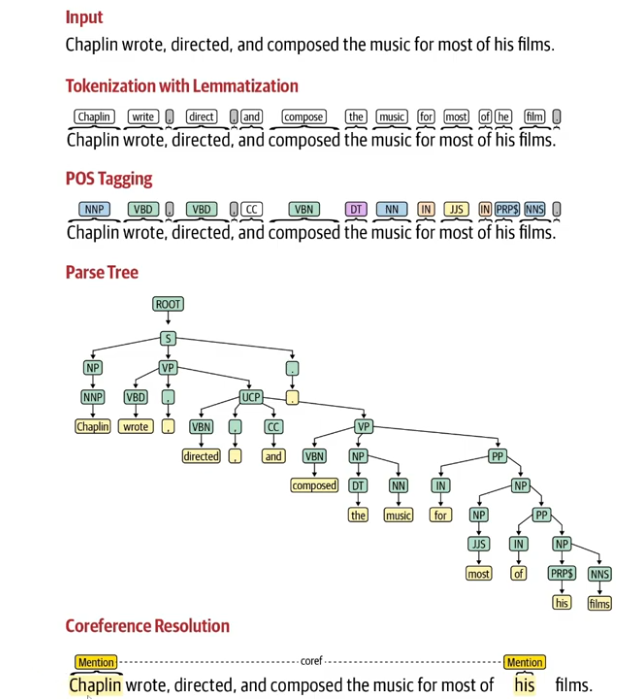

# Attention_is_all_you_need

## Generative AI Pipeline

### Data Aquisition
### Data Augmentation

    1. Replace with Synonyms etc.
    2. Biagram flip 
        (My name is Amad -> Amad is my name)
    3. Back translate
        Translate to other language a couple of times and back to english.
    4. Add additional Data/Noise
        I am a Data Scientist -> I am a Data Scientist and I live this job.

### Data Preparation

    1. Clean Up: 
        Rempve HTML Tags, Emojis, Spelling Correction
    2. Basic Preprocessing:
        Tokenization -> Sentence, Word
    3. Optional Preprocessing:
        Stop Word Removal
        Stemming (Less Used)
            play, played, playing -> play
        Lamatization
            Similar to stemming but improved*
        Punctation Removal
        Lower case
        Language Detection
    4. Advanced Preprocessing:
        Parts of Speech Tagging
        Parsing
        Coreference Resolution

### Feature Engineering

Text Vectorization
    TF-IDF
    Bag of Words
    Word2Vec
    OH Encoding
    Transfomers Model

### Modeling

Choose Model
    Open Source LLM
    Paid Model
        OpenAI etc.

### Evaluation

1. Intrinsic Evaluation -> Metrics -> GenAI Developer
2. Extrinsic Evaluation -> After Deployment (Feedback Incorporation)

### Deployment

### Monitoring and Model Updating

### Common Terms

Corpus -> Entire Text
Vocabulary -> Unique Words
Docuemnts -> Subset of the text
Word -> Single Word

