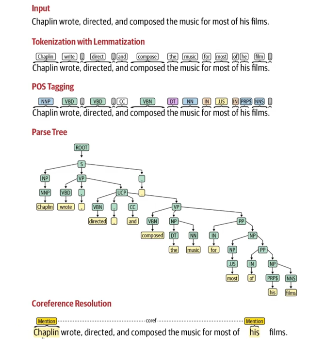

# Attention_is_all_you_need

## Generative AI Pipeline

    Data Aquisition
    Data Augmentation

        Replace with Synonyms etc.
        Biagram flip 
            (My name is Amad -> Amad is my name)
        Back translate
            Translate to other language a couple of times and back to english.
        Add additional Data/Noise
            I am a Data Scientist -> I am a Data Scientist and I live this job.

    Data Preparation

        Clean Up: 
            Rempve HTML Tags, Emojis, Spelling Correction
        Basic Preprocessing:
            Tokenization -> Sentence, Word
        Optional Preprocessing:
            Stop Word Removal
            Stemming (Less Used)
                play, played, playing -> play
            Lamatization
                Similar to stemming but improved*
            Punctation Removal
            Lower case
            Language Detection
        Advanced Preprocessing:
            Parts of Speech Tagging
            Parsing
            Coreference Resolution

            

    Feature Engineering
    Modeling
    Evaluation
    Deployment
    Monitoring and Model Updating

